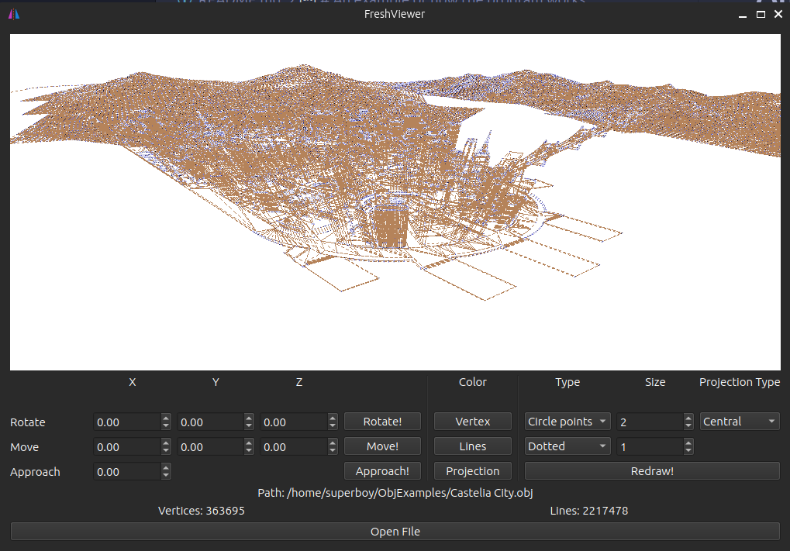
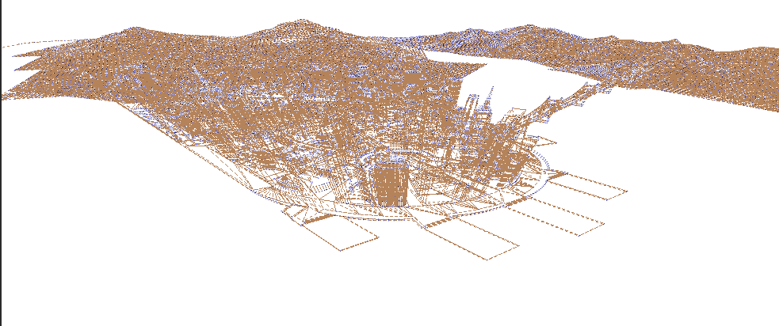
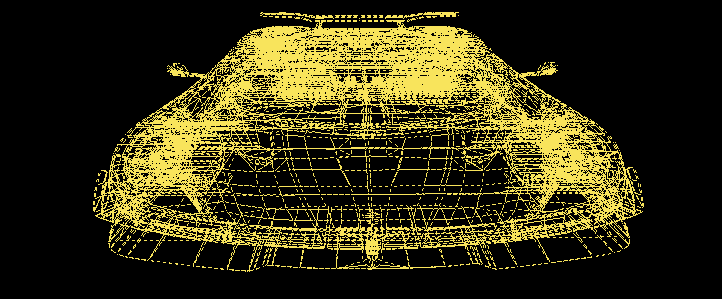
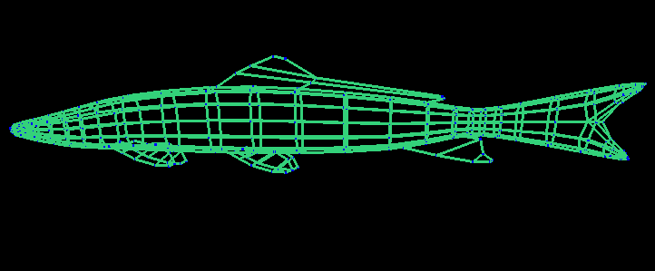

# FreshViewer
In this project we need to implement an application for viewing 3D wireframe models in C++ in the object-oriented programming paradigm, implementing the same functions as the previously developed application in 3DViewer v1.0 project.

>It was necessary to use the way of organizing the MVC code, 3 design patterns (facade, strategy and observation were chosen). Multithreaded basic level data processing was used.

# Install

## Requirements for technologies

- Qt6 
- QOpenGl
- cmake3

## Instructions

- Install/Uninstall app

`cd src/`

`make install`

`make uninstall`

- Docs

`make dvi`

- Unit-tests

`make test`

- Tests coverage

`make gcov_report`

- Get archive

`make dist`

- Get valgrind or fsatinaizer report

`make valgrind`

`make fsatnitaizer`

# An example of how the program works

