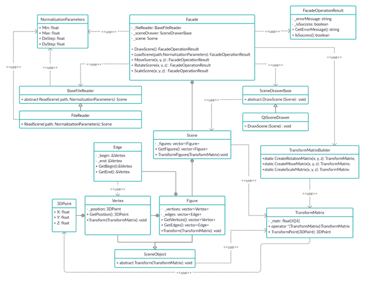

# FreshViewer
In this project we need to implement an application for viewing 3D wireframe models in C++ in the object-oriented programming paradigm, implementing the same functions as the previously developed application in 3DViewer v1.0 project.

Processing 
